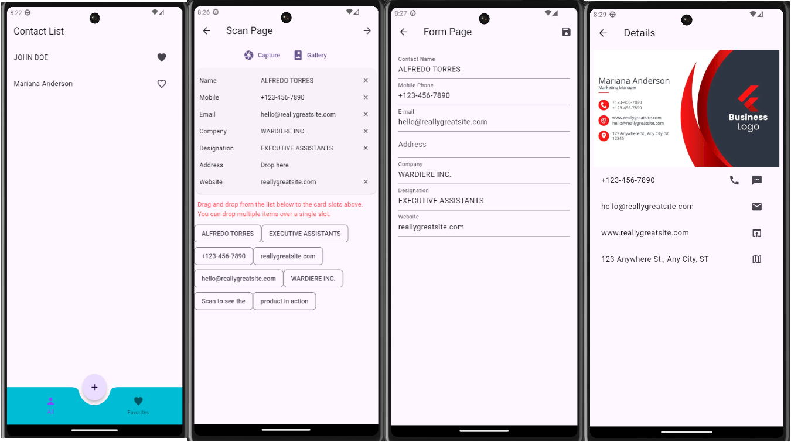

# vcard_project

A virtual card project in Flutter and Dart.

## Description

This is a virtual card application developed in Flutter with Dart lang for Android and iOS devices that helps to maintain all our bussiness cards in one place. You can scan physical cards with your device camera or pick from phone gallery, retrive text data, edit if necessary and create a contact that will be saved in a local database. In the end of the process you'll have access to contact details, mark a contact as favorite and perform actions through contact details using native device apps such as call, send sms or email, visit website and open location in map.

## Photos

## Key implementations

- Scan text using text recognition.
- Persist data in local database.
- Capture or pick images.
- Perform platform specific actions.
- Use of Dismissible and FutureBuilder widgets.
- Use of router for navigation.
- Use of provider for state managment.
- Perform a secure migration of database.

## Dependencies used

- [google_mlkit_text_recognition:](https://pub.dev/packages/google_mlkit_text_recognition)
- [sqflite:](https://pub.dev/packages/sqflite)
- [image_picker:](https://pub.dev/packages/image_picker)
- [url_launcher:](https://pub.dev/packages/url_launcher)
- [flutter_easyloading:](https://pub.dev/packages/flutter_easyloading)
- [provider:](https://pub.dev/packages/provider)
- [go_router:](https://pub.dev/packages/go_router)

##

For help getting started with Flutter development, view the
[online documentation](https://docs.flutter.dev/), which offers tutorials,
samples, guidance on mobile develop
ment, and a full API reference.
